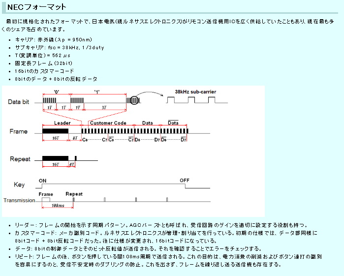

## 機能
- NECフォーマットにて赤外線通信（出力）を行う  
   
    - カスタムコードは0x93固定（無効データ）
    - データは操作コード
- ボタン操作にて操作コードを決定する
    - 0 : None
    - 1 : MainFanOn
    - 2 : MainFanMove
    - 3 : Timer
    - 4 : LeftRightFan
    - 5 : UpDownFan

## ポート構成

|PinNo|PortType|Method|Description|
|:---:|:---:|:---:|---|
|2|CCP5|isrTimer0()|IrPulseの出力|
|3|RA4|TaskInputCode()||
|4|RA3|〃|SW入力|
|5|RA2|〃|〃|
|6|RA1|〃|〃|
|7|RA0|〃|〃|

## 関数表

### void isrTimer0(void)
概要：　Timer0を使った424usインターバル割り込み  
依存：　Timer0オーバーフロー割込み  
　　　　sIrSendTime,sIrBufPos,sIrLowWidth,sIrHighWidth,sIrBuf  
影響： gInterval,sIrEndBit  

処理説明  
- gInterval変数を使ったインターバルフラグ
- PSTR1CONbits.STR1A（CCP5出力許可レジスタ）とLATA5を使って  
赤外線信号波形を生成処理（出力ON/OFF制御）  

### void SendIr( uint8_t customCode, uint8_t dat)
概要：赤外線送信データを登録する  
依存：無し  
影響：sIrSendTime,sIrBufPos,sIrLowWidth,sIrHighWidth,sIrBuf  
備考：IsSendIrEnableで送信処理完了を確認する事  

引数：  
- customCode : 送信データのカスタムコード
- dat : 送信データのデータ本体

処理説明：  
- 送信データをsIrBufに詰めて、sIr変数群にヘッダー信号生成用のデータを渡す  
sIr変数群にデータを渡すことで送信処理が開始される  

### uint8_t TaskInputCode( void )
概要：スイッチ操作から操作コードを出力する  
依存：RA0-4  
影響：無し  

戻値：操作コード

処理説明：  
- スイッチ操作をコードに変換する。  
操作なしの場合、０を出力
